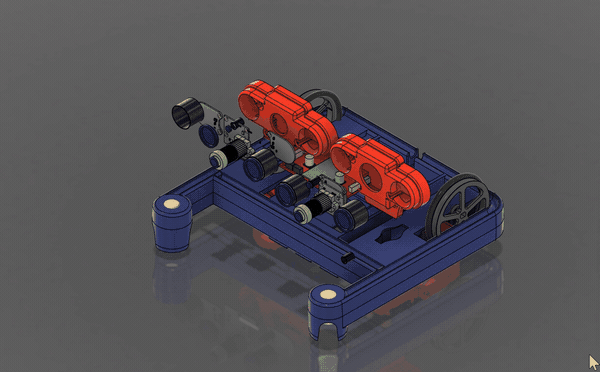
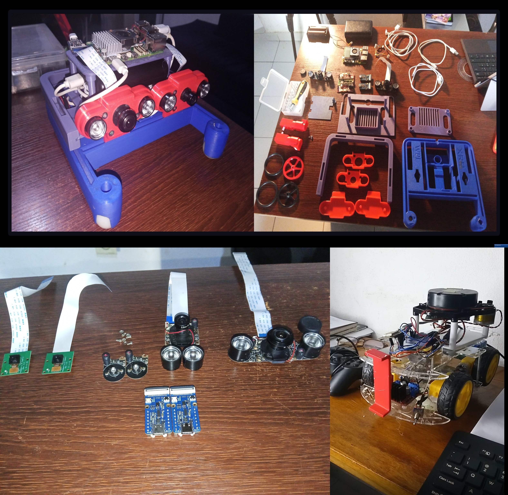

# 🤖 ROS 2 Ten Months Challenge

A long-term ROS 2 robotics challenge documenting my progression from ROS 2 fundamentals and micro-ROS to AI perception, stereo vision, SLAM, and autonomous robotics using the XRP platform.



This repository is a **collection of practical ROS 2 projects**. Each project lives in its own folder under [`projects/`](projects/) with its own README, firmware, and ROS 2 workspace, so it can be read, built, and run independently.

---

## 📚 Projects

| # | Project | What it covers | Status |
|---|---------|----------------|--------|
| 01 | [Teleoperation with micro-ROS](projects/01_teleop_microros/README.md) | ROS 2 ↔ micro-ROS over UDP, `teleop_twist_keyboard`, custom node driving an ESP32 motor controller | ✅ Done |
| 02 | [Stereo AI Perception Robot (XRP)](projects/02_stereo_ai_perception_xrp/README.md) | Dual night-vision cameras, Grove AI V2 object detection, stereo depth, ROS 2 perception topics, micro-ROS → Pico → XRP, path to SLAM | 🚧 In progress |

---

## 🗂️ Repository layout

```
.
├── projects/                     # One folder per project, each self-contained
│   ├── 01_teleop_microros/
│   │   ├── README.md
│   │   ├── firmware/             # PlatformIO micro-ROS firmware (ESP32)
│   │   └── ros2_ws/src/          # ROS 2 packages
│   └── 02_stereo_ai_perception_xrp/
│       ├── README.md
│       ├── firmware/             # micro-ROS firmware (RP2040 / Pico on XRP)
│       ├── ros2_ws/src/          # ROS 2 perception & control packages
│       ├── calibration/          # Camera intrinsics / stereo extrinsics
│       ├── scripts/              # Standalone test & bring-up scripts
│       └── docs/                 # Wiring, notes, measurements
├── test_camera/                  # Bench tool: Grove Vision AI V2 feed on Windows
├── docs/resources/               # Shared reference material (papers, PDFs)
└── assets/images/                # Images used across READMEs
```

---

## 🔧 Tools

| Tool | What it does |
|------|--------------|
| [`test_camera/`](test_camera/README.md) | Six bench tests for the perception hardware, before any ROS 2 is involved: SenseCraft model loading, live camera feed, night-vision check, camera/lens properties, stereo rig calibration (writes ROS 2 `CameraInfo`), and a three-panel live stereo depth view |

---

## 🧰 Common prerequisites

- **ROS 2 Jazzy** — [installation guide](https://docs.ros.org/en/jazzy/Installation.html)
- **micro-ROS Agent** — [first application tutorial](https://micro.ros.org/docs/tutorials/core/first_application_linux/)
  (skip *"Building the firmware"* and *"Creating the micro-ROS agent"*)
- **PlatformIO** (VS Code extension or CLI) for building microcontroller firmware
- `colcon`, `rosdep`, and a working `~/ros2_ws` build setup

Source ROS 2 in every terminal you use:

```bash
source /opt/ros/jazzy/setup.bash
```

---

## 🚀 Getting started

```bash
git clone https://github.com/TheAfricanJiant/ROS--2-Ten-Months-Challenge.git
cd ROS--2-Ten-Months-Challenge
```

Then open the README of the project you want to run:

- [Project 01 — Teleoperation with micro-ROS](projects/01_teleop_microros/README.md)
- [Project 02 — Stereo AI Perception Robot (XRP)](projects/02_stereo_ai_perception_xrp/README.md)

---

## 📖 Resources

Shared reference material lives in [`docs/resources/`](docs/resources/):

- [ICC kinematics](docs/resources/icckinematics.pdf) — instantaneous centre of curvature / differential-drive kinematics

---

## 🗺️ Roadmap

- [x] micro-ROS transport working over Wi-Fi (UDP)
- [x] Keyboard teleoperation driving real motors
- [ ] Dual camera + Grove AI V2 object detection
- [ ] Stereo calibration and depth estimation
- [ ] ROS 2 perception topics (detections + distance)
- [ ] micro-ROS on RP2040 driving the XRP from `/cmd_vel`
- [ ] Follow behaviours (colour → object → person)
- [ ] Stereo obstacle avoidance
- [ ] SLAM and autonomous navigation
