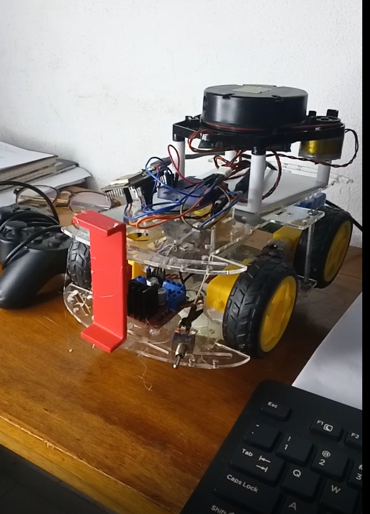

# 🎮 Project 01 — Teleoperation with micro-ROS

[← Back to repository index](../../README.md)

Keyboard teleoperation of a differential-drive robot: ROS 2 on the host publishes `/cmd_vel`, a custom node converts it to motor commands, and an ESP32 running micro-ROS receives them over Wi-Fi (UDP) and drives the motors.



**Demo video**

[](https://www.youtube.com/watch?v=8mwOU-UvqDQ)

---

## 📁 Contents

```
01_teleop_microros/
├── firmware/                 # PlatformIO project for the ESP32 (micro-ROS client)
│   ├── platformio.ini
│   └── src/main.cpp
└── ros2_ws/src/
    └── teleop_to_motor/      # ROS 2 node: /cmd_vel → motor commands
```

---

## 📜 Prerequisites

- ROS 2 (Jazzy)
- **micro-ROS Agent** package — install with [this guide](https://micro.ros.org/docs/tutorials/core/first_application_linux/)
  - ⚠️ **Skip** *"Building the firmware"* and *"Creating the micro-ROS agent"*
- PlatformIO (VS Code extension or CLI)
- An ESP32 board and a motor driver

---

## 🛠️ Setup & running

### 1️⃣ Flash the ESP board with micro-ROS

Open `firmware/` in PlatformIO and upload it to the ESP32.

```bash
cd projects/01_teleop_microros/firmware
pio run --target upload
```

### 2️⃣ Build the ROS 2 workspace

```bash
cd projects/01_teleop_microros/ros2_ws
source /opt/ros/jazzy/setup.bash
colcon build
source install/setup.bash
```

### 3️⃣ Start the micro-ROS agent

```bash
ros2 run micro_ros_agent micro_ros_agent udp4 --port 8888
```

🕐 **Wait** for the ESP board to connect. It will print:

```
Subscriber created
```

✅ The ESP board is now communicating with ROS 2.

---

## 🎮 Running teleoperation

Open **four terminals**, sourcing ROS 2 in each one:

```bash
source /opt/ros/jazzy/setup.bash
```

**Terminal 1 — keyboard teleop**

```bash
ros2 run teleop_twist_keyboard teleop_twist_keyboard
```

💡 Keep this terminal focused and use the control keys to move the robot.

**Terminal 2 — motor control**

```bash
ros2 run teleop_to_motor teleop_to_motor
```

🚗 The robot should now respond to keyboard commands.

**Terminal 3 — topic echo**

```bash
ros2 topic echo /your_topic_name
```

**Terminal 4 — ROS graph**

```bash
rqt_graph
```

---

## 🛠️ Troubleshooting

- If the ESP board doesn't connect, restart the micro-ROS agent and verify the board firmware.
- If the robot doesn't move, check that `teleop_to_motor` is running and echo the topic.
- Confirm the ESP32 and the host are on the same network and that the agent port (`8888`) matches the firmware.

---

## 📖 Related resources

- [ICC kinematics](../../docs/resources/icckinematics.pdf)
