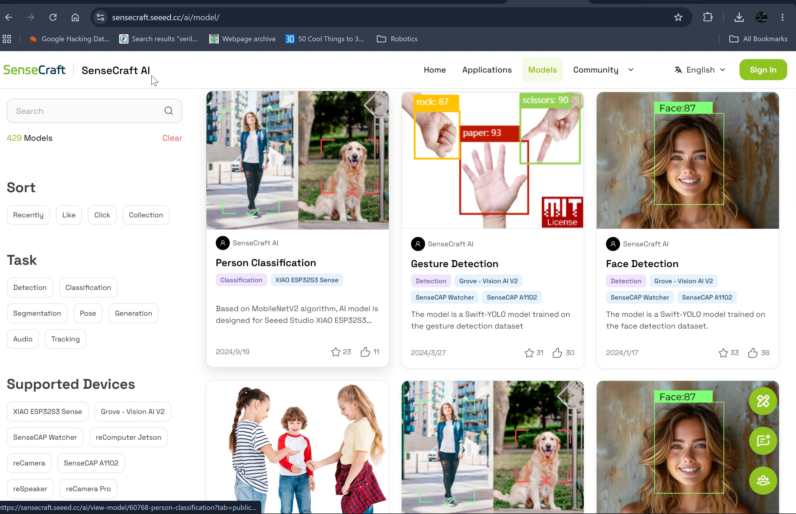
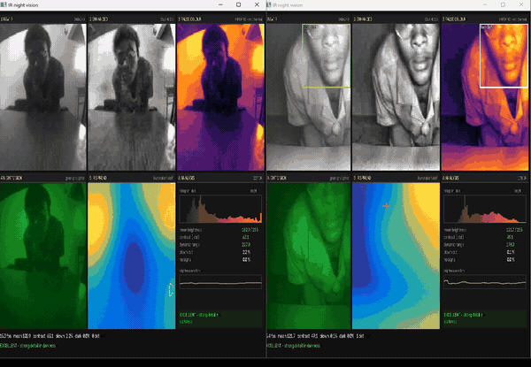
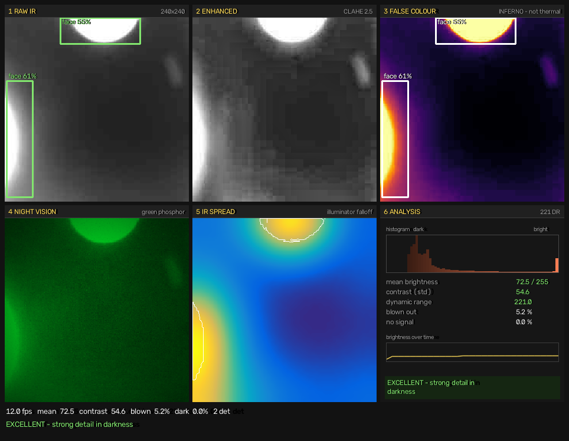
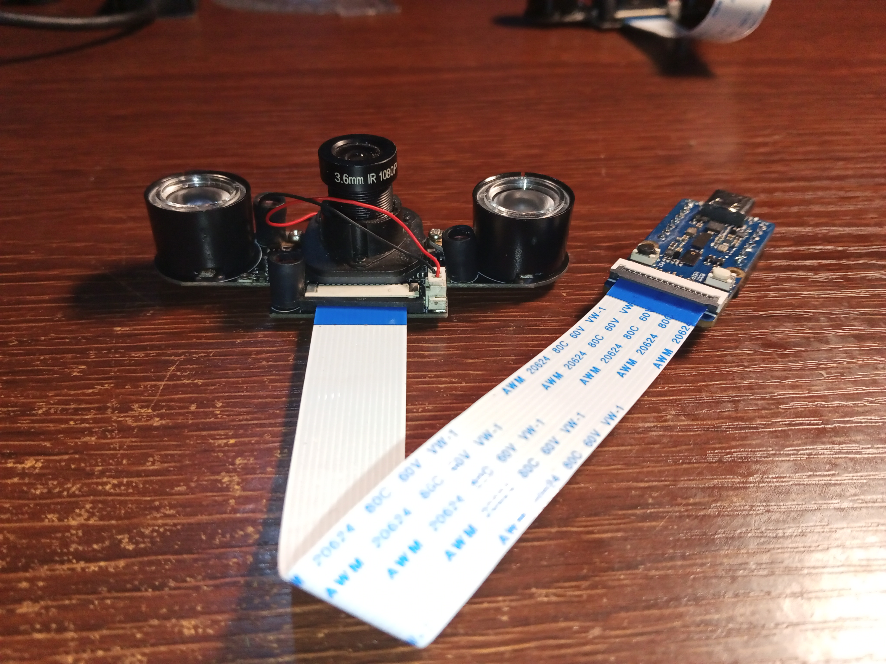
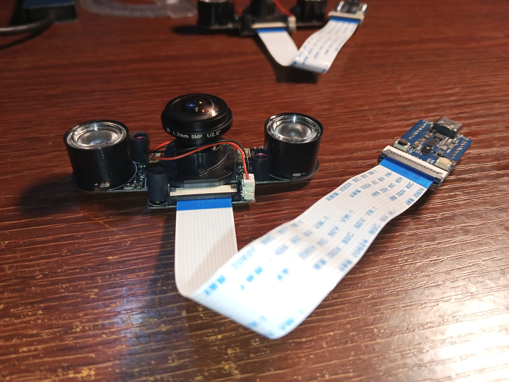
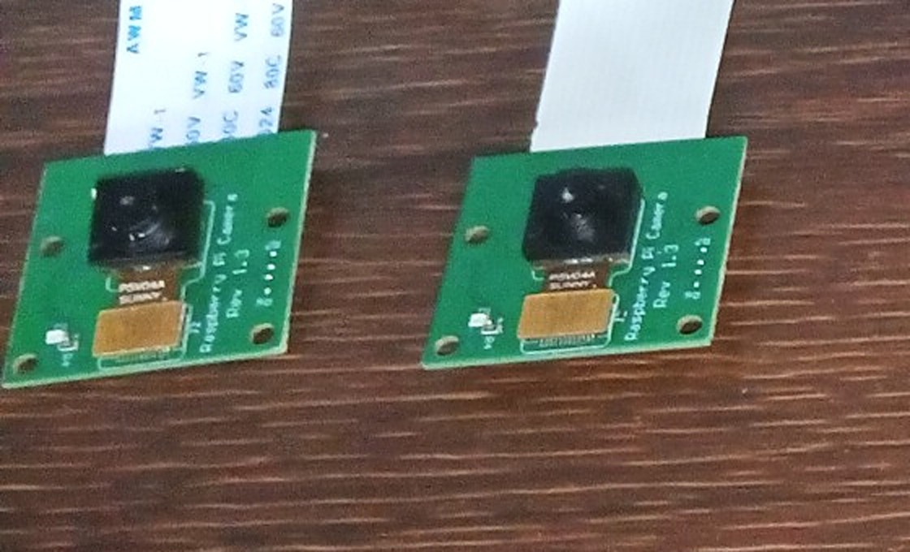
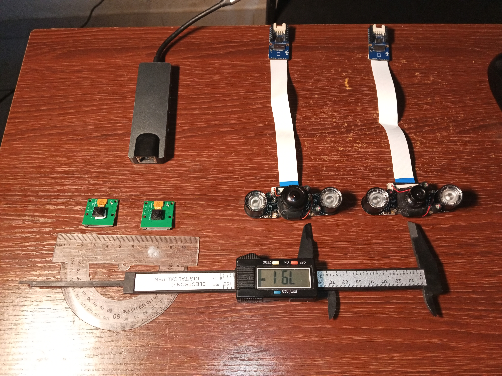
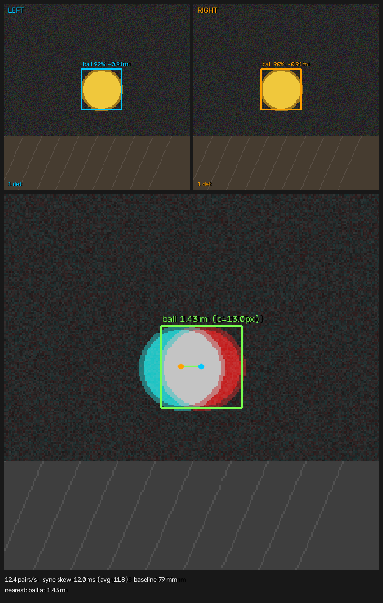
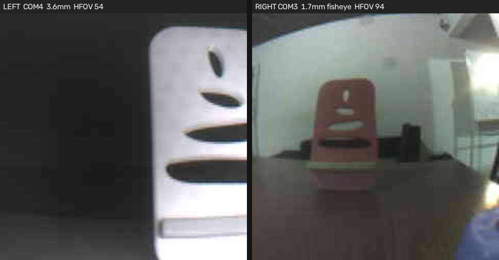

# 📷 test_camera — cameras, night vision and stereo depth

[← Back to repository index](../README.md)

Bench tooling for [Project 02](../projects/02_stereo_ai_perception_xrp/README.md),
Objectives 2 and 3. Get two Grove Vision AI V2 boards proven, measured and
producing a depth reading — before any of it touches ROS 2.

---

## Quick start

Four steps from nothing to a live stereo distance:

```bash
# 1. Load the SAME detection model on BOTH boards, from SenseCraft AI (browser)
# 2. Measure each lens's real focal length
python camera_info.py --measure

# 3. Measure the rig and write the ROS 2 config
python calibrate_stereo.py

# 4. Run stereo
python stereo_vision.py --config stereo_config.yaml
```

Everything else on this page is setup, a test to confirm a step worked, or
reference material.

---

## Command reference

### Setup and diagnosis

| Command | What it does |
|---------|--------------|
| `python stream_camera.py --list-ports` | List serial ports, with each board's stable `SER=` id. |
| `python diagnose.py [PORT]` | Which firmware a board is actually running. Run this when a board produces nothing. |
| `python flash_firmware.py --image FILE.img --port PORT --dry-run` | Enter the bootloader and confirm it will accept a flash. Writes nothing. |
| `python flash_firmware.py --image FILE.img --port PORT` | Reflash a board stuck on the wrong firmware. |
| `python stream_camera.py --info [--port PORT]` | Identity, camera, resolutions, and the flashed model with its class names. |

### Cameras and lenses

| Command | What it does |
|---------|--------------|
| `python camera_info.py --list` | Every known camera, with focal length and field of view. |
| `python camera_info.py --show KEY` | One camera in detail (`ir-3.6mm`, `ir-1.7mm`, `rpi-v1`, …). |
| `python camera_info.py --add` | Describe a camera not in the list; saved to `custom_cameras.yaml`. |
| **`python camera_info.py --measure`** | **Measure real focal length in pixels. Do this before trusting any distance.** |
| `python camera_info.py --mode --port A --port B` | Day or night mode (IR-cut state) per camera, and whether they agree. |

### The main path

| Command | What it does |
|---------|--------------|
| **`python calibrate_stereo.py`** | **Measure the rig; writes `stereo_config.yaml` + ROS 2 `left.yaml`/`right.yaml`.** |
| `python calibrate_stereo.py --left PORT --right PORT --baseline 0.079` | Same, non-interactive. |
| **`python stereo_vision.py --config stereo_config.yaml`** | **Live stereo: both eyes plus the triangulated distance.** |
| `python stereo_vision.py --config ... --no-detect` | Both feeds, no model, no depth. Checks the cameras are aligned. |

### Testing and demos — optional

None of these are required to get depth working.

| Command | What it does |
|---------|--------------|
| `python stream_camera.py [--port PORT]` | One camera, live. Use it to focus a lens by hand. |
| `python stream_camera.py --detect` | One camera with the model's boxes drawn. |
| `python camera_info.py --night --port PORT` | Pass/fail: does this camera still see with the lights off? |
| `python night_vision.py --port PORT` | Six-view IR viewer. A demo, not a step. |
| `python night_vision.py --port PORT --detect --record out.avi` | The same, with detections, recording to video. |

### Useful flags

| Flag | Applies to | Meaning |
|------|-----------|---------|
| `--port PORT` | most | Serial port. Omitted, the tool asks each port who it is and picks the board that answers. |
| `--resolution 0\|1\|2` | `stream_camera`, `night_vision` | 240×240 / 480×480 / 640×480. |
| `--detect` | `stream_camera`, `night_vision` | Run the flashed model. Needs a model loaded. |
| `--scale N` | viewers | Upscale the preview. |
| `--no-refine` | `stereo_vision` | Use raw box centres instead of sub-pixel matching. Much noisier; comparison only. |
| `--smooth N` | `stereo_vision` | Median-filter depth over N frames (default 3, `1` disables). |
| `--box-format corner` | anywhere with `--detect` | If boxes land down-and-right of the object. Default `center` is correct on firmware `2025.01.02`. |

Keys in any viewer: `q`/`Esc` quit, `s` snapshot, `d` toggle overlays.
`night_vision` adds `p` palette, `r` record, `1`–`6` focus a panel, `0` grid.
`stereo_vision` adds `a` to toggle the anaglyph.

---

## Setup

| OS | Status |
|----|--------|
| **Windows 11** | **Tested.** Everything here was developed and run on Windows. |
| **Linux** | **Not tested.** Nothing is Windows-specific, but no one has run it. |
| **macOS** | **Not tested.** Same. |

<table>
<tr><th>Windows</th><th>Linux</th><th>macOS</th></tr>
<tr valign="top"><td>

```powershell
cd test_camera
py -m venv .venv
.venv\Scripts\Activate.ps1
pip install -r requirements.txt
```

If PowerShell blocks activation:
`Set-ExecutionPolicy -Scope Process -ExecutionPolicy Bypass`

</td><td>

```bash
cd test_camera
python3 -m venv .venv
source .venv/bin/activate
pip install -r requirements.txt
```

Serial access needs group membership:
`sudo usermod -a -G dialout $USER`
then log out and back in.

</td><td>

```bash
cd test_camera
python3 -m venv .venv
source .venv/bin/activate
pip install -r requirements.txt
```

The boards use a WCH CH343 bridge. Recent macOS has the driver; older
versions need WCH's.

</td></tr>
</table>

Ports are `COM3` on Windows, `/dev/ttyACM0` on Linux, `/dev/cu.wchusbserial*`
on macOS. This page writes `PORT` as a placeholder.

---

## Step 1 — Load a model

Everything downstream needs one. Without a model the boards return pictures but
no detections, and stereo has nothing to triangulate.



1. Open [SenseCraft AI](https://sensecraft.seeed.cc/ai/model) in **Chrome or
   Edge** — Web Serial does not exist in Firefox or Safari.
2. Connect the board, choose **Grove Vision AI V2**.
3. Pick a **Detection** model — *Face Detection* is a good first choice.
4. **Repeat on the second board with the same model.** The two eyes must agree
   on what they are looking at. `stereo_vision.py` compares the model
   checksums and refuses to run on a mismatch.

**Close the SenseCraft tab afterwards.** It holds the serial port open and
every other tool then fails with *access denied*.

Confirm with `python stream_camera.py --info`, which reads the model's own
metadata:

```
Model: Face Detection  (id 60094, task detect)
  classes: face
  confidence threshold 60%, IoU 45%
```

Class names come from there automatically — no labels file needed.

> `AT+MODELS?` reports `size: 0` whether or not a model is flashed. The only
> reliable source is the base64 metadata in `AT+INFO?`, which is what these
> tools read.

---

## Step 2 — Check the cameras

Confirm both boards produce frames, then move on.

```bash
python stream_camera.py --port PORT                # is there a picture?
python camera_info.py --mode --port A --port B     # do both agree on day/night?
```

**Focus is mechanical.** No AT command exists. Turn the M12 lens barrel while
streaming. The 1.7 mm fisheye is fiddly — a small turn moves it from sharp to
useless.

**Day/night switching is also mechanical.** The IR-cut filter and the
illuminators are driven by a light sensor on the camera module itself; the
Vision AI V2 can neither read nor control them. Probing the firmware returns
`Unknown command` for every one of `AT+FOCUS?`, `AT+EXPOSURE?`, `AT+GAIN?`,
`AT+AEC?`, `AT+AWB?`, `AT+ICR?`, `AT+IRCUT?`, `AT+LED?`, `AT+NIGHT?`. To force
a mode, light or shade the small photo-sensor between the IR LEDs.

`--mode` infers the state by measuring colour: with the IR-cut filter removed,
infrared floods all three channels equally and a lit room comes back
colourless.

```
COM4: saturation   2.4%  ->  NIGHT (IR-cut removed)
COM3: saturation  11.5%  ->  DAY (IR-cut in place)
MISMATCH: these cameras are in different modes.
```

**Get both into the same mode before calibrating.** One eye seeing infrared
while the other does not makes the same scene look different to each.

### Optional: night-vision tests

Not needed for stereo. Useful to confirm the IR illumination works, and good
for showing the rig off.

```bash
python camera_info.py --night --port PORT    # pass/fail in darkness
python night_vision.py --port PORT           # six live views
```





Panels: **RAW**, **ENHANCED** (CLAHE, pulls detail out of shadow), **FALSE
COLOUR** (`p` cycles palettes), **NIGHT VISION** (green phosphor), **IR
SPREAD** (where the illuminators actually throw light — angle them if the
bright patch is not on your subject), **ANALYSIS** (histogram, exposure,
verdict).

> **These are not thermal cameras.** They see near-infrared *reflected off
> things* — the IR LEDs are a torch you cannot see. Brightness, never
> temperature. In the heat palette a cold white wall reads "hot". For real
> temperature you need a thermal sensor such as an MLX90640.

A plain Raspberry Pi camera fails the night test by design: its IR-cut filter
blocks exactly the wavelength the LEDs emit.

---

## Step 3 — Measure your lenses

Stereo depth needs focal length **in pixels**:

```
f_px = focal_length_mm × image_width_px ÷ sensor_width_mm
```

The datasheet value is **nominal**. It assumes the board maps the full sensor
width onto the image, and the Vision AI V2 crops and scales before you see a
frame. If it crops, the true focal length is larger and every distance is wrong
by the same ratio.

```bash
python camera_info.py --measure
```

Show the camera something of known width (A4 is 0.297 m) at a measured
distance, note its pixel width, and the tool solves
`f_px = pixels × distance ÷ width`. No datasheet involved. Give the answer to
`calibrate_stereo.py` when it asks.

### The cameras

| | Camera | Key | Sensor | Focal | HFOV (computed) | Vendor claim | Sees IR | IR LEDs |
|---|---|---|---|---|---|---|---|---|
|  | **IR 3.6 mm 1080P** | `ir-3.6mm` | OV5647, 1/4″ | 3.6 mm | **54.0°** | 72° | ✅ | ✅ |
|  | **IR 1.7 mm fisheye** | `ir-1.7mm` | OV5647, 1/4″ | 1.7 mm | **94.4°** | 150° | ✅ | ✅ |
|  | **Raspberry Pi Camera v1.3** | `rpi-v1` | OV5647, 1/4″ | 3.6 mm | **54.0°** | 53.5° | ❌ | ❌ |

Also available: `rpi-v1-noir`, `rpi-v2`, `rpi-v2-noir`, `rpi-v3`. Add your own
with `camera_info.py --add`.

The fisheye's vendor gap is real: `1/2.5″` is the lens's *image circle*, not
the sensor behind it. On a 1/4″ OV5647 only the middle is used — about 94°, not
150°.

---

## Step 4 — Calibrate the rig

```bash
python calibrate_stereo.py
```



It asks for two measurements:

**Baseline** — distance between the two **lens centres**, as in the photo.
Measure the lenses, not the boards. This sets the entire depth scale: 10% out
means every distance is 10% out.

**Convergence** — the angle between the optical axes. Both pointing straight
ahead is **0**; just press Enter. A guessed angle is worse than an honest zero.

It writes:

| File | Purpose |
|------|---------|
| `stereo_config.yaml` | The rig, in ROS 2 parameter layout. `stereo_vision.py` reads it. |
| `left.yaml` / `right.yaml` | `sensor_msgs/CameraInfo`, with the baseline as `Tx = -fx × B`. |

So the stock ROS 2 pipeline can use the same rig:

```bash
ros2 run <your_pkg> <your_node> --ros-args --params-file stereo_config.yaml
```

**Calibrate at the resolution you will run at.** The focal lengths in the
config depend on it, and `stereo_vision.py` drives the sensors to match.

---

## Step 5 — Run stereo

```bash
python stereo_vision.py --config stereo_config.yaml
```



*(Rendered from synthetic frames at a known 1.5 m, to show the layout.)*

- **LEFT / RIGHT** — each camera's detections. The distance is a *monocular
  guess* from an assumed object size; a sanity check, not a measurement.
- **Combined** — both frames as a red/cyan anaglyph, so disparity is visible as
  colour fringing. Wide fringes mean close. This panel carries the real
  **triangulated** distance.

Distances tagged `sub-px` were refined by image matching. Ones without fell
back to the box centre and are far noisier.

### Getting a believable number

1. Same model on both boards.
2. The object must be visible to **both** cameras.
3. Keep it near the image **centre**, especially with the fisheye.
4. Use a **measured** focal length, not the nominal one.
5. Check against a tape measure. If everything is off by a constant ratio, the
   baseline or focal length is wrong.

---

## Running a mixed-lens rig

A 3.6 mm and a 1.7 mm together works, but two things need care.



*Same room, same moment. The chair fills the 3.6 mm frame and sits small in the
fisheye — that is 54° versus 94°, not a focus or distance problem.*

**Matching happens in angular units.** The same object is 2.12× taller through
the 3.6 mm lens — a 4.5× area ratio, which any size test rejects as "not the
same object". Detections are normalised by each camera's own focal length
first, which removes the lens from the comparison.

**Depth is matched on image content, not bounding boxes.** Detection boxes
wobble a few pixels every frame, and on a short baseline that wobble dominates
everything else. The left patch is rescaled to the right camera's angular
scale, correlated against the right image, and the peak fitted for a
fractional-pixel position. Benchmarked at 240×240 over 160 random depths from
0.7–3.2 m:

| Box jitter | Box centres | Sub-pixel | Gain |
|-----------|-------------|-----------|------|
| 0 px (unrealistic) | 96 mm | 110 mm | 0.9× |
| **1 px** | 627 mm | **110 mm** | **5.7×** |
| **2 px** | 942 mm | **110 mm** | **8.5×** |
| 3 px | 1157 mm | 111 mm | 10.5× |

The refined column does not move — it locks onto the picture and ignores the
box. It costs **1.9 ms per detection, about 2.6% of a frame**, so it stays on
by default. With a textureless patch or a correlation below 0.35 it refuses and
falls back to the box centre, dropping the `sub-px` tag.

### Precision, and the resolution trade

Depth error scales as `Z² / (f × B)` — it grows with the *square* of distance,
and shrinks with focal length and baseline. At 1.5 m, per pixel of error:

| Rig | 1 px = |
|-----|--------|
| Two 3.6 mm, 240×240 | 131 mm |
| **3.6 mm + fisheye, 240×240 (default)** | **308 mm** |
| 3.6 mm + fisheye, 640×480 | 103 mm |

A mixed rig inherits the *worse* camera's precision — the sharp one buys you
nothing.

**640×480 is 3× more precise but halves the frame rate** (13.7 fps → 6.1) and
pushes sync skew from ~47 ms to ~72 ms. **240×240 is the default**, because
frame rate matters more for a moving robot. Switch with
`calibrate_stereo.py --width 640 --height 480` only if you need the precision
and can accept the slowdown.

**Widening the baseline is the free win**: error scales as 1/B, so 79 mm →
150 mm nearly halves it at no cost in speed.

### What no amount of code fixes

- **Overlap** — only the middle ~54° of the fisheye is shared. Aim both
  cameras at the same place.
- **Fisheye distortion** — the pinhole model breaks down away from centre.
  Keep the target central, or run a checkerboard calibration.
- **Synchronisation** — no hardware trigger exists. Frames are paired by
  arrival time, and skew sits at ~47 ms with almost no spread: a near-constant
  phase offset of about half a frame period, not jitter. Fine for a slow robot;
  wrong for anything fast.

---

## How it works

| AT command | Purpose |
|------------|---------|
| `AT+SAMPLE=-1` | Stream frames, no model — the plain camera feed. |
| `AT+INVOKE=-1,0,0` | Stream frames with inference; include the JPEG, report every frame. |
| `AT+BREAK` | Stop streaming. |
| `AT+SENSORS?` / `AT+SENSOR=` | Cameras and resolutions. The only sensor control there is. |
| `AT+INFO?` | Base64 model metadata — name, classes, checksum. |
| `AT+ID?` / `AT+NAME?` / `AT+VER?` | Identity. |

Replies are one JSON object per line wrapped in `\r` … `\n`; `type` is `0` for
a response, `1` for a streamed event, `2` for a log line. Base64 never contains
a newline, so splitting on `\n` is enough framing.

Depth uses **ray intersection**, not `Z = f·B/d` — the textbook formula assumes
parallel cameras, whereas intersecting the two viewing rays handles a toed-in
rig too and agrees exactly when parallel.

```
test_camera/
├── stream_camera.py     # single camera feed
├── camera_info.py       # lens properties, focal measurement, night + mode checks
├── calibrate_stereo.py  # measure the rig -> ROS 2 config
├── stereo_vision.py     # three-panel live stereo
├── night_vision.py      # six-panel IR viewer (demo)
├── diagnose.py          # which firmware is a board running?
├── flash_firmware.py    # reflash over the bootloader's X-Modem receiver
└── sscma/
    ├── protocol.py      # framing + JSON parsing, no I/O
    ├── client.py        # serial transport, AT commands, frame decoding
    ├── cameras.py       # lens/sensor properties and optics
    ├── config.py        # rig config, ROS 2 readable
    ├── stereo.py        # sync capture, matching, triangulation
    └── viewer.py        # OpenCV presentation
```

`sscma/` imports OpenCV lazily, so protocol, optics and stereo maths carry no
GUI dependency — a ROS 2 node can reuse them and publish `sensor_msgs/Image`
instead of calling `imshow`.

---

## Troubleshooting

| Symptom | Cause / fix |
|---------|-------------|
| "No serial ports found" | Charge-only USB-C cable — very common. Use a data cable. |
| Access denied | Another program holds the port — usually a SenseCraft tab in Chrome. On Linux, add yourself to `dialout`. |
| That port does not exist | Board unplugged, or it came back on a different port. `--list-ports`. |
| Port opens but no frames | `python diagnose.py PORT` — usually the wrong firmware, not the camera. |
| "did not answer AT+NAME?" | Not running sscma-micro. See [Recovering a board](#recovering-a-board). |
| Feed dark in a lit room | Still in night mode. `camera_info.py --mode`; light the photo-sensor between the IR LEDs. |
| Blurry at every distance | Focus is mechanical — turn the lens barrel while streaming. |
| "No model is flashed" | Go back to Step 1. |
| Boxes offset down-and-right | Add `--box-format corner`. |
| "no object matched in both eyes" | Object outside the overlap, or only one board has the model. |
| Distances wrong by a constant ratio | Baseline or focal length. Re-measure; run `camera_info.py --measure`. |
| Distances jump around | Check the readout says `sub-px`. If not, too little texture to match and it is using the jittery box centre. |
| "No synchronised pair in Ns" | Re-run `calibrate_stereo.py` at the resolution you are using, so the sync tolerance is set correctly. |

---

## Recovering a board

If a board produces nothing **no matter which camera or cable you try**, stop
swapping hardware. Run `python diagnose.py`. The line that matters:

| | Healthy | Wrong firmware |
|---|---|---|
| `slot flash_offset` | `0x00100000` | `0x00000000` |
| `AT+NAME?` @ 921600 | `"Grove Vision AI V2"` | nothing |

Slot `0x00000000` is **Himax factory test firmware** — no camera application at
all. The bootloader is fine, so the board is recoverable.

**SenseCraft cannot fix this**: its connect flow waits for the SSCMA handshake,
which is the firmware that is missing.

1. Close the SenseCraft tab.
2. Download the firmware matching your working board from the
   [official releases](https://github.com/Seeed-Studio/sscma-example-we2/releases)
   (e.g. `grove_vision_ai_v2_20250102.img`).
3. `python flash_firmware.py --image FILE.img --port PORT --dry-run` — expect
   `Set X-modem flag = Yes` and `receiver is ready`. If not, hold **BOOT** while
   plugging the cable in.
4. Same command without `--dry-run`. ~18 s. Do not unplug.
5. `python diagnose.py PORT` → `HEALTHY`.

Only the application slot is written; the bootloader is untouched, so a failed
transfer leaves the board no worse off.

---

## Verification status

**Verified on hardware** — two Grove Vision AI V2 boards on Windows 11
(firmware `2025.01.02`): identity, sensor enumeration, model metadata and class
names, resolution switching, continuous decoding, night-mode checks, IR-cut
state detection, and two-board synchronised capture at 14.7 pairs/s (240×240)
with matching model checksums. `flash_firmware.py` recovered a board stuck on
factory firmware end to end. Centre-origin boxes confirmed by rendering both
interpretations against a real detection.

**Verified by test harness** — protocol framing including byte-at-a-time
arrival, JPEG decode, box conversion and clamping, command rejection, timeouts;
triangulation recovering known 3D points to 1e-6 m for parallel, toed-in and
mixed-lens rigs; angular matching across different lenses; sub-pixel refinement
benchmarked against known geometry including its refusal behaviour; config
round-trips and `Tx = -fx·B`.

**Not verified**

- **A real distance against a tape measure.** All the machinery runs on the two
  boards, but the accuracy figures come from synthetic scenes with known
  geometry.
- **Linux and macOS.**
- **Fisheye undistortion.** Not implemented; `distortion_coefficients` are
  zero. For the 1.7 mm that is a real limitation off-centre — run
  `ros2 run camera_calibration cameracalibrator` and paste the coefficients in.
